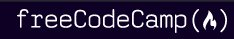

<h1 align="center">
    
    
    
    
</h1>

<h2 align="center">
	 🚧 Exercies Resolution 👽
</h4>
<p align="center">
  

  <a href="https://www.linkedin.com/in/kaiorr/">
    
  </a>

  <a href="https://github.com/kaiorr/coderbyte/commits/master">
    
  </a>

  
   <a href="https://github.com/kaiorr/coderbyte/stargazers">
    
  </a>
</p>


## ℹ Para que serve esse Repo?

Este repositório será destinado a resolução de todos desafios nas plataformas acima citadas.

Os exercícios resolvidos serão separados em diretórios por linguagem de programação.


## 🚀 Technologies

* Javascript[JS]
* Typescript[TS]


### 🤔 How to contribute

```bash
   #Make a fork;
   #Create a branck with your feature:
    git checkout -b my-feature
   #Commit changes:
    git commit -m 'feat: My new feature'
   #Make a push to your branch:
    git push origin my-feature

#After merging your receipt request to done, you can delete a branch from yours.
```

## 📝 License

This project is under the MIT license. See the [LICENSE](https://github.com/kaiorr/codeSignal/blob/master/LICENSE).

Made with ♥ by Kaio Ribeiro  [Get in touch!](https://www.linkedin.com/in/kaio-ribeiro-310123150/)
